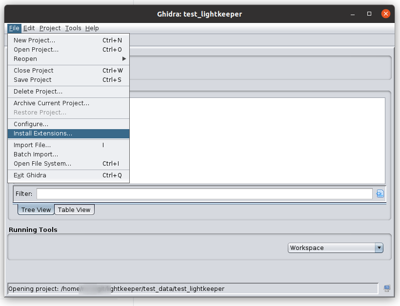
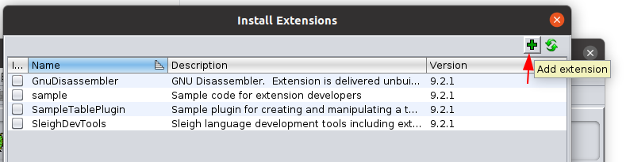

## Installing the extension

* Save & close any open code browsers
* Either download the pre-built extension from [github](https://github.com/WorksButNotTested/lightkeeper/releases/latest).
* Or [build it yourself](HACKING.md): e.g. [gradle -PGHIDRA_INSTALL_DIR=$GHIDRA_HOME](https://github.com/WorksButNotTested/lightkeeper/blob/9fdab0b90edc0dcc4df1194f0470be466b9da559/.github/workflows/build_on_tag_push.yml#L37-L40)
* 
* 
